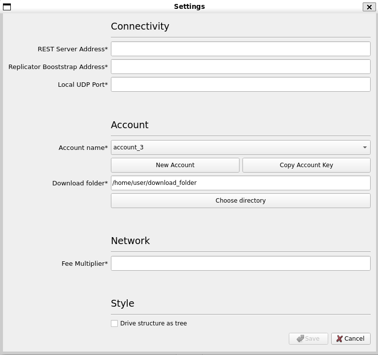
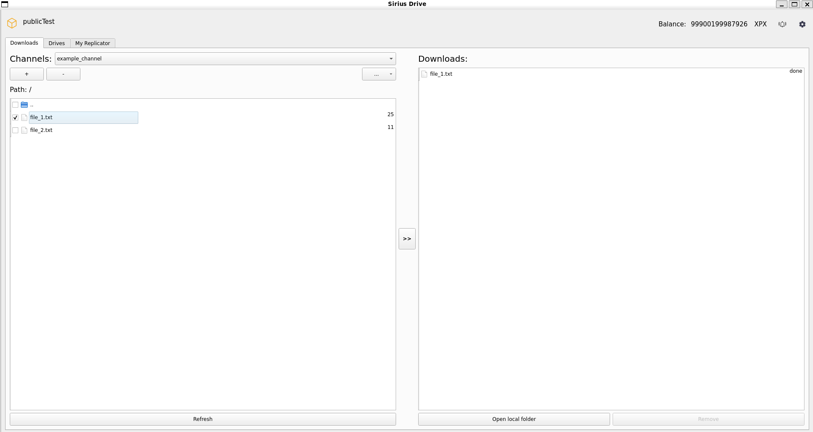

# cpp-xpx-storage-user-app

## Prerequisites

* C++ compliler with C++20 support
* CMake 3.9 or higher
* [Conan] (https://conan.io)
* Qt 5.12.8 or higher
* Boost 1.71.0 or higher 
* [Cereal] 1.3.2 or higher (https://github.com/USCiLab/cereal)


## Build for MacOS
```shell
git clone https://github.com/proximax-storage/cpp-xpx-storage-user-app.git
cd cpp-xpx-storage-user-app
git submodule update --init --recursive --remote
```

### Build cpp-xpx-storage-user-app
```shell
mkdir build && cd build
cmake -DSIRIUS_DRIVE_MULTI=ON ..
```

### Building with *nix Make
```shell
make -j 4
sudo make install
```

## User Manual

**Note that most operations within the storage tool application use XPX.**<br><br>

### Log In
When you open the storage tool application for the first time, you will be prompted to create an account.<br>

<br>Enter your preferred storage tool `Account name`, your `Private key` from your wallet account that has XPX in it, and `Save`.<br><br>

### User Interface Overview
When you have successfully logged in, this is what the application will look like:


The upper left corner indicates that the application is running on `publicTest` network.

In the upper right corner, we have our wallet `Balance` in XPX, which comes from the wallet account in the `publicTest` network.

The `Gear` icon on the upper right corner of the application interface is the `Settings` tab.<br><br>

### Settings
The `Settings` tab looks like this:


Enter the `REST Server Address` (`54.151.169.225:3000`) , `Replicator Bootstrap Address` (`13.250.14.143:7904`), and `Local UDP Port` (`7999`).

As for the `Account name`, this has usually been set up for you once you have logged in. You can create a `New Account`, and copy account key and address as well.

You can click `Choose directory` to set up a folder/directory from your PC (local folder) as the folder for downloading files within the drive application. It will be used in `Downloads` tab later on.

For the Network section, enter your `Fee Multiplier`.
For now, the application only works if you put `200000`.

You can also choose to set the drive structure style to `Drive structure as tree`.

After that, `Save` your changes and the application will restart.<br><br>

### Drives

This is what the `Drives` tab looks like:<br>


#### Create Drive
You can create a new drive to store your local files. To do this, press the `+` sign. This will prompt out a new window to create new drive.


Enter your preferred drive `Name`, `Replicator number`, `Max drive size` (in Megabytes), and your `Local drive folder` (folder in your PC that you want to make available as an upload drive), and then `Confirm`. After that, wait until there is notification that the drive is created successfully.

**Currently, each replicator can only store 2 GB data. So please create a smaller size drive (e.g. 100 MB, 200 MB).**

The `Open local folder` button below the left side tab can be used if you want to see files and folders inside your local drive folder.

#### Drive Tabs (Left Side and Right Side Tabs)
If you do not have any files in the local drive folder, the drive (left side tab) will be empty. You can modify the state of your local drive, for example, add or remove files from it. 
If you add files to your local drive folder, they will appear as green in the right side tab. When you click `Apply changes`, the new local files will be sent to the remote drive.
If you remove files from your local drive folder, they will appear as red in the right side tab. By clicking `Apply changes` you will delete these files from the remote drive.
The file differences between drive and local drive folder is what we call "diff". The `Calculate diff` button below the right side tab of the drive is created to calculate this diff. The diff is automatically calculated if you just add or remove files in the local drive folder. When you modify contents of any sub-folder of the local drive, you should use `Calculate diff` because the diff is not automatically calculated within subfolders.

#### Upload and Remove Files and Folders
For example, in this case:


The left side tab (the drive) already has `file_2.txt` uploaded earlier. The right side tab (the diff between remote drive and local drive folder) shows that `file_1.txt` has just been added to your local drive folder and not yet uploaded to the remote drive (green colour). `file_2.txt` has just been removed from your local drive folder and not yet deleted from the remote drive (red colour). To make the changes (to upload `file_1.txt` to the drive and remove `file_2.txt` from the drive), you should use `Apply changes`. 

Then the modification status will appear (the modification phases are: registering, uploading, completing).<br>


After that, both the drive and local drive folder will have the same files (but not same folders because empty folders are not uploaded).<br>


#### Remove Drive
You can also remove the drive by choosing which drive to remove, and pressing `-` button.


#### More Options for Drive Operations
You can also choose more options for drive operations through `...` button.


The options are:<br>
`Rename`: rename your drive.<br>
`Change local folder` change your local drive folder.<br>
`Top-up`: choose a drive and perform a top up.<br>
`Copy drive key`: copy the drive's key for your needs.<br>
`Drive info`: see the drive information (drive name, replicator number, max drive size, local drive folder).<br><br>

### Downloads

This is what the `Downloads` tab looks like:<br>


#### Create Download Channel

You can create a new download channel by pressing the `+` button. This will prompt out a new window to create a new download channel. Download channel is the place where you can download files from drives.<br>


Enter your preferred download channel's `Name`, the `Drive Key` that you want to download the files from, `Prepaid` amount of data you want to download (in MB), and then press `Confirm`. After that, wait for a  notification that the channel is created successfully.

#### Download Channel Tabs (Left Side and Right Side Tabs)
The left side tab is displaying files in the drives for downloading (you have set them earlier in `Settings` tab). In other words, the left side tab is the download channel. The right side tab displays the files you have downloaded from the channel, including the status of download (for example: `%` (download progress in percentage) status, `done` status).

The file changes (add or remove) you made in the drive will be automatically reflected in the download channel.

You can also refresh the download channel through `Refresh` button. The `Open local folder` opens your download folder locally. The `Remove` button is used to delete the files you are trying to download/have downloaded from your local download folder.

#### Download Files
To download files from download channel, first you need to choose/checklist the files you want to download on the left .<br>

For example, in this case, the `file_1.txt` is chosen for download.


Then press `>>` to download the file to your local folder.<br>

Wait for the file to be downloaded (progress will be shown in percentage). Wait until the status is done like below:


You can see that the file is in your download folder now.


#### Remove Download Channel

Similarly to removing a drive, you can also remove a download channel by choosing which channel to remove, and pressing `-` button.<br>


#### More Options for Download Channel Operations

You can also choose more options for download channel operations through `...` button.


The options are:<br>
`Rename`: rename the download channel.<br>
`Top-up`: choose a download channel and perform a top up.<br>
`Copy channel key`: copy the download channel's key for your needs.<br>
`Channel info`: see the download channel information (download channel name, ID, drive ID, replicators assigned, keys, and prepaid amount).<br>


