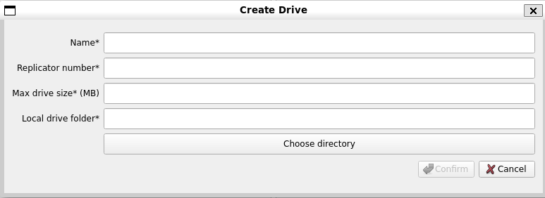
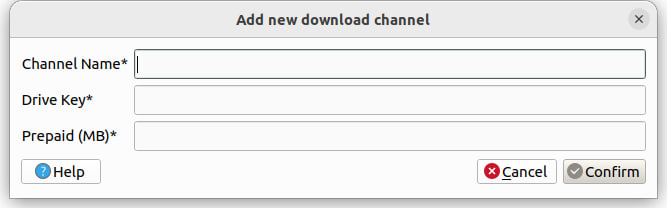

# cpp-xpx-storage-user-app

## Prerequisites

* C++ compliler with C++20 support
* CMake 3.9 or higher
* [Conan] (https://conan.io)
* Qt 5.12.8 or higher
* Boost 1.71.0 or higher 
* [Cereal] 1.3.2 or higher (https://github.com/USCiLab/cereal)


## Build for MacOS
```shell
git clone https://github.com/proximax-storage/cpp-xpx-storage-user-app.git
cd cpp-xpx-storage-user-app
git submodule update --init --recursive --remote
```

### Build cpp-xpx-storage-user-app
```shell
mkdir build && cd build
cmake -DSIRIUS_DRIVE_MULTI=ON ..
```

### Building with *nix Make
```shell
make -j 4
sudo make install
```

## User Manual

**Note that most operations within the storage tool application uses XPX.**

### Log In
When you open the storage tool application for your first time, you will be prompted to create a storage tool account.<br>

<br>Enter your preferred storage tool `Account name`, your `Private key` from your wallet account that have XPX in it, and `Save`.<br><br>

### User Interface Overview
When you have successfully log in, this is what the application will look like:


The upper left corner indicated that the application is running on `publicTest` network.

On the upper right corner, we have our wallet `Balance` in XPX, which comes from the wallet account in the `publicTest` network.

We also have the `Gear` icon on the upper right corner of the application interface, which is the `Settings` tab.<br><br>

### Settings
The `Settings` tab will looks like this:


Enter the `REST Server Address`, `Replicator Bootstrap Address`, and `Local UDP Port`.

As for the `Account name`, this has usually been set up for you once you have logged in. You can create a `New Account`, and `Copy Account Key` as well.

If the `Download folder` column is empty. You can `Choose directory` from folder/directory from your PC (local folder) to be set up as folder for downloading files within the drive application. This will be used in `Downloads` tab later on.

For the Network section, enter your `Fee Multiplier`.
For now, the application only works if you put `200000`.

You can also choose to set the drive structure style to `Drive structure as tree`.

After that, `Save` your changes and the application will restart.

### Drives

This is what our `Drives` tab looks like:<br>


#### Create Drive
We can create a new drive to store our local files. To do this, we can press the `+` sign. This will prompt out a new window to create new drive.


Enter your preferred drive `Name`, `Replicator number`, `Max drive size` (in Megabytes), and your `Local drive folder` (folder in your PC that you want to make available as a drive), and then `Confirm`. After that, wait until there is notification that the drive is created successfully.

For now, the number of replicator we should use is `4`.
Currently, each replicator can only store 2 GB data. So please create a smaller size drive (e.g. 100 MB, 200 MB).

The `Open local folder` button below the left side window can be used if you want to see files and folders inside your local drive folder.

#### Drive Windows (Left Side and Right Side Windows)
If you do not have any files within the local drive folder, then the drive will be empty. We can start adding files to local drive folder, and then the right window of the drive will show which files are available in the local drive folder, but not inside the drive (marked as green, which mean we can perform an upload operation) and which files are not available in the local drive folder, but available inside the drive (marked as red, which mean we can perform a remove operation).

The file differences between drive and local drive folder is what we call "diff". This is why we have `Calculate diff` button below the right window side. But the diff will be automatically calculated if we just add or remove files on the local drive folder's root (root is the top/upper level of a folder). When we add or remove files inside sub-folder (folder inside other folder) of the local drive folder, this is where we need to use `Calculate diff` because the diff is not automatically calculated in this case.

#### Upload and Remove Files and Folders
For example, in this case:


The left side window (the drive) already have file_2.txt uploaded earlier. And the right side windows (the diff between drive and local drive folder) shows that our file_1.txt has just been added to our local drive folder and not yet uploaded to the drive (green colour), and the file_2.txt has just been removed from our local drive folder and not yet been removed from the drive (red colour). To make the changes (to upload file_1.txt to the drive and remove file_2.txt from the drive), we can use `Apply changes`. 

And then the modification status will appear (modification phases: registering, uploading, completing).<br>


And after that, both the drive and local drive folder will have the same files (but not same folders because empty folder is not uploaded).<br>


#### Remove Drive
We can also remove the drive by choosing which drive we want to remove, and press `-` button.


#### More Options for Drive Operations
You can also choose more options for drive operations through `...` button.


The options are:<br>
`Rename`: To rename your drive.<br>
`Change local folder`: To change your local drive folder.<br>
`Top-up`: To allows you to choose a drive and perform top up.<br>
`Copy drive key`: To allows you to copy the drive's key for your needs.
`Drive info`: To see the drive information (drive name, replicator number, max drive size, local drive folder).<br>

### Downloads

This is what our `Downloads` tab looks like:<br>


#### Create Download Channel

We can create a new download channel by pressing the `+` button. This will prompt out a new window to create a new download channel. Download channel is where we are able to download files from drives.<br>


Enter your preferred download channel's `Name`, the `Drive` that you want to download the files from, `Keys` (optional), `Prepaid` amount, and then press `Confirm`. After that, wait until there is notification that the channel is created successfully.

#### Download Channel Tabs (Left Side and Right Side Tabs)
The left tab will be displaying files within the drives you have choose earlier. In other words, the left tab is the download channel. The right tab will display the files you have downloaded from the download channel, including the status of download (for example: percentage (download progress), done).

The file changes (add or remove) you made from the drive will be automatically reflected in the download channel.

You can also refresh the download channel through `Refresh` button.
The `Open local folder` is used to open your download folder locally.
The `Remove` button is used to remove the files you are trying to download/have downloaded, and this will be reflected to your local download folder (in other word, it will also delete files in your download folder).

#### Download Files
To download files from download channel, first you need to choose/checklist the box on the left side of the filenames you want to download.<br>

For example, in this case, I choose the file_1.txt to download.


Then press `>>` to download the file to your download folder (the one we configured in `Settings` tab).<br>

Wait for the file to be downloaded (will be shown in percentage). Wait until the status is done like below:


And then you can see that the file is in your download folder now.


#### Remove Download Channel

Similar to remove drive, we can also remove download channel by choosing which download channel we want to remove, and press `-` button.<br>


#### More Options for Download Channel Operations

You can also choose more options for download channel operations through `...` button.


The options are:<br>
`Rename`: To rename the download channel.<br>
`Top-up`: To allows you to choose a download channel and perform top up.<br>
`Copy channel key`: To allows you to copy the download channel's key for your needs.<br>
`Channel info`: To see the download channel information (download channel name, ID, drive ID, replicators assigned, keys, and prepaid amount).<br>


